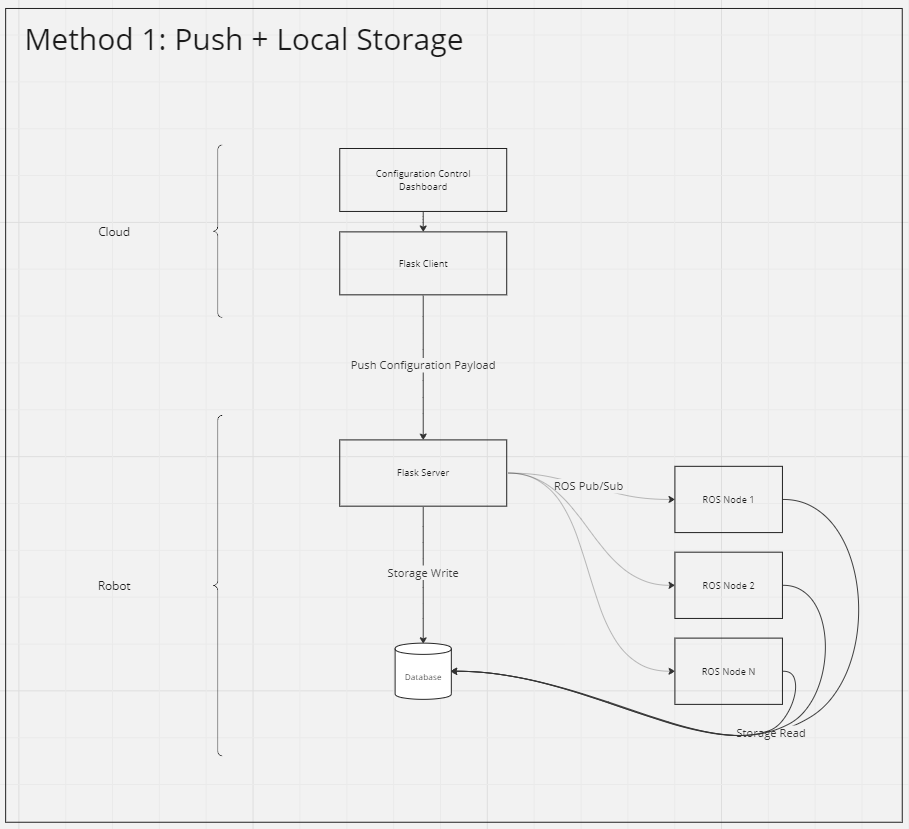

# Challenge

The research team have developed a new locus_ai component for our robots to detect butterflies in real-time. Parameters for the butterfly model are available on from a web-service running in the cloud. 

# Questions

- How would you (in a few hours) extend the bringup to enable real-time reconfiguration of the detection system? 
- What suggestions can you make for larger changes in the system architecture?
- How do your changes make the reconfiguration process smoother or more reliable?

## How to Extend Bringup for Real-Time Reconfiguration

1. **Enable Real-Time Reconfiguration**: Implement communication between the ROS 2 nodes and the web service to fetch updated parameters in real-time.

2. **Dynamic Reconfiguration**: Integrate ROS 2's dynamic reconfigure package to allow nodes to adjust their behavior based on parameter updates.

3. **Node Restart Mechanism**: Implement a mechanism for nodes to gracefully restart when necessary to apply new parameters.

## Suggestions for Larger Changes in System Architecture

1. **Decentralized Parameter Management**: Distribute parameter management across multiple nodes to reduce load and improve scalability.

2. **Offline Parameter Caching**: Implement offline caching of parameters on robots to handle intermittent connectivity issues.

3. **Edge Computing**: Explore edge computing solutions to offload parameter processing tasks from resource-constrained robots.

## Reconfiguration Process Improvements

1. **Event Based Reconfiguration**: The reconfiguration process is triggered in the cloud via the configuration control dashboard.
The new configuration payload is dispatched to each robot, as required, and stored/updated in the database. On the robot, the flask 
server handles the incoming request accordingly and dispatches a ROS Pub/Sub notification to each ROS node requesting a configuration update.
Each ROS node in turn would read the database for the new configuration payload, check if a restart is required, restart, and 
apply the new configuration.

# Design Assumptions

- Robots are resource constrained, battery powered, and on an unreliable Wi-Fi network.
- The Flask webserver is running in the cloud, and robots are behind a NAT/firewall in a client network.
- Multiple robots are deployed in the client network.
- A single robot will have hundereds of nodes that will be requiring parameters
- The client network will have multiple robots. For this scenario assume 2 robots are deployed.

# Included Samples

A sample ROS2 project and Flask web-service are provided. Please see the README for execution instructions.

# Guidelines

1. Please do not go too overboard with your solution, however it should try and cover the main points.
2. Aim for completion within a couple of hours.
3. Provide explanation on the solution and how to run it.
4. Bonus: 
    - Use Docker to set up and bring up individual nodes.
    - Extend design to support hundreds of robots on a client network.

# Design

## Build

`docker build -t ros2_service_project .`

## Run

`docker run -it --rm ros2_service_project`

## How it Works

Once the docker is running, it will automatically start up the Flask servers and ROS nodes.
For this demo, there's 2 Flask servers for showcase purposes to show benefits and drawbacks and 
how it works. Then, initiate a configuration update and send a payload, by following the next section.
Note: The DB portion is not implemented and instead the payload is sent with Pub/Sub just for demonstration. 

## Trigger Configuration Update:

### Config Update No Payload

This is a very sub optimal solution, but it's here to showcase how it may work.
This will trigger a configuration pull request where each ROS node will pull its own configuration payload. 

`curl -X POST -H "Content-Type: application/json" -d '{"trigger_update": true}' http://localhost:6000/update_parameters_no_payload`

### Config Update With Payload

This is a preferred solution as it will provide the updated, versioned configuration payload, 
and forward an update notification to each ROS node via Pub/Sub. After which, the ROS node can check if update
is needed, query for the payload from the DB (for now the payload is sent via Pub/Sub, which is sub optimal due to comms overhead), 
and restart if necessary.

`curl -X POST -H "Content-Type: application/json" -d '{
  "trigger_update": true,
  "parameters": [
    { "my_parameter": "from_flask" }
  ]
}' http://localhost:6000/update_parameters
`